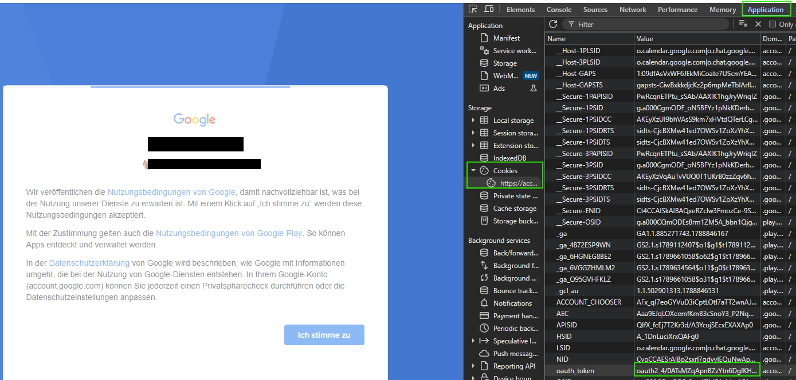
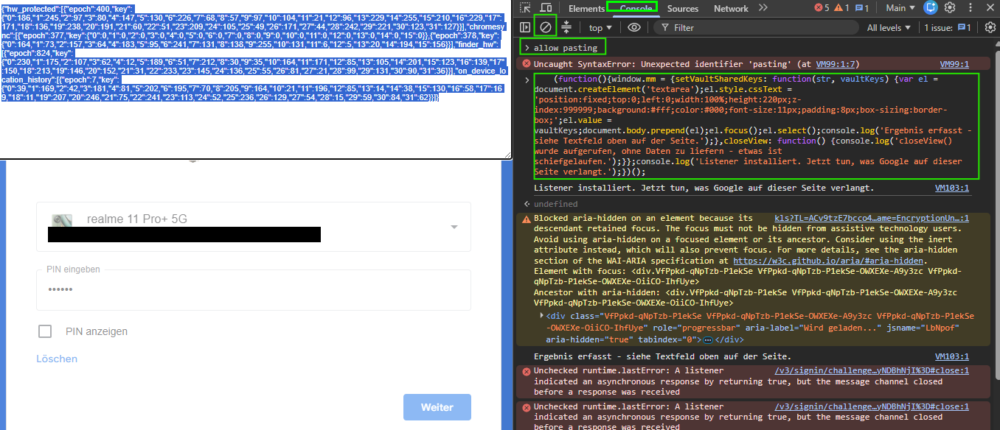

# ioBroker.googlefindmydevice

ioBroker adapter to read tracker locations (e.g. Bluetooth item trackers) from
[Google Find Hub / Find My Device](https://www.google.com/android/find), Google's
device- and item-tracking service, and expose them as ioBroker states.

> **Supported devices:** Bluetooth item trackers only (e.g. Chipolo,
> Pebblebee - anything on Google's "Find My Device" network). Phones, tablets
> and other devices linked to the same Google account are **not** supported
> and will not show up as ioBroker objects - see
> [Why not phone/tablet locations too?](#why-not-phonetablet-locations-too)
> below for why. For those, keep using Google's own app or
> [google.com/android/find](https://www.google.com/android/find).

## Status: early development

Google does not offer an official API for Find Hub. This adapter is being built
on top of a reverse-engineered understanding of the protocol, cross-referenced
against [leonboe1/GoogleFindMyTools](https://github.com/leonboe1/GoogleFindMyTools)
(GPL-3.0). Because Find Hub tracker locations are end-to-end encrypted and
Google only delivers a fresh location asynchronously over its push
infrastructure, this is inherently more involved than a typical REST-API
adapter and may break if Google changes its internal protocol.

Currently implemented and confirmed working against real Google accounts:

- Reading a Google account's Bluetooth trackers (name, manufacturer, model,
  Fast Pair ID, pairing date, device type) and keeping them updated on a poll
  interval. Phones, tablets and other non-tracker devices linked to the
  account are deliberately left out - Google's API returns no usable data for
  them here, and phone location would need an entirely different, browser-
  session-based API this adapter doesn't use (see below).
- Decrypting real location reports once available (latitude, longitude,
  altitude, last-seen time, or a semantic location like "Home").
- Actively requesting a fresh location per tracker ("locate now"), with an
  enable/interval setting per device in the adapter configuration - see
  **Requesting locations** below.
- All setup happens inside the adapter's own configuration page in ioBroker
  Admin - see **Setup** below. No separate program or browser automation is
  needed or used.

## Setup

The adapter needs a one-time login to your Google account. No password is
ever entered into the adapter - only a short-lived token you copy out of
your own browser, exactly like you'd copy an API key from some other web
dashboard:

1. Open `https://accounts.google.com/EmbeddedSetup` in your own browser (a
   button for this is in the adapter's configuration page).
2. Don't log in yet. First open your browser's developer tools (`F12`) →
   "Application" tab → "Cookies" → `https://accounts.google.com`. The list is
   still empty - that's expected, it fills in once you log in. Leave this
   developer tools window open.
3. Now log in with the Google account your trackers are linked to (including
   two-factor confirmation if enabled). The page may look empty afterwards,
   or get stuck on something like "I agree" and not visibly proceed - that's
   normal (it isn't meant for humans), the token is already valid by then.
4. Switch back to the already-open developer tools and find the row named
   `oauth_token` (refresh the list if needed):

   

5. Copy its full value, paste it into the adapter instance's configuration
   page (in ioBroker Admin) and save.

The `oauth_token` value only stays valid briefly, so do steps 3-5 in quick
succession - step 2 can be done beforehand without any rush.

The adapter exchanges that value for a long-lived token on its own, clears
the pasted value from its configuration, and restarts. From then on it
refreshes what it needs by itself - you only repeat this if Google
invalidates the session at some point down the line.

**Why not automate this login?** An earlier version of this project tried
driving a real browser (Puppeteer) through the login. Google reliably
detects that and blocks it with "this browser or app may not be secure" -
confirmed by testing. The reliable fix for that is dedicated bot-detection-
evasion tooling, which this project deliberately does not use. Logging in
yourself, in your own normal browser, sidesteps the problem entirely since
there is nothing to detect.

### Step 2: unlock location decryption

Once Step 1 is done, the adapter restarts and logs a link and a small script
(see the instance log, level "warn") needed to unlock the end-to-end
encryption key. This also happens entirely in your own browser:

1. Open the link from the log in your browser.
2. Open developer tools (`F12`).
3. Switch to the **Console** tab.
4. Clear the console (the 🚫 icon), just to keep things tidy.
5. Chrome blocks pasting into the console by default. Type `allow pasting`
   manually and press Enter.
6. Now paste the script from the log and press Enter. Complete whatever
   Google asks for on the page (e.g. entering a phone's screen-lock PIN to
   confirm it's really you), then click "Weiter"/"Next":

   

7. A text field appears at the top of the page with the captured result.
   Copy it completely, paste it into the adapter's configuration page under
   "Result from the browser console (JSON)" and save.

## Requesting locations

Google only ever hands out a location report if something actually asked the
tracker for one recently - listing devices alone almost never returns
coordinates. Getting a fresh one means actively pinging the tracker over
Bluetooth (via whichever nearby Android phone hears it), which **noticeably
uses that tracker's battery**. Because of that, this adapter does **not**
request locations for any tracker automatically.

Once Step 2 (location decryption) is set up, a table appears in the adapter
configuration listing every discovered tracker with two settings each:

- **Request location** - off by default for every newly discovered tracker.
  Turn it on for the trackers you actually want live coordinates for.
- **Interval (minutes)** - how often to request a fresh location for that
  tracker while it's enabled (5 minutes minimum, so it's still possible to
  request one relatively often for something like an actively-moving bike,
  without hammering it constantly).

Device names, manufacturer/model info and pairing date are always kept
up to date on the regular poll interval regardless of these settings, since
reading that doesn't touch the tracker itself.

## Why not phone/tablet locations too?

Investigated and deliberately not implemented. Phones and tablets linked to
the account use a completely different Google system for location than
Bluetooth trackers: the same web app as
[google.com/android/find](https://www.google.com/android/find), authenticated
with a full Google **browser session** (cookies) rather than the narrowly-
scoped Android Device Manager token this adapter uses for everything else,
talking to an undocumented internal RPC ("batchexecute") and push channel
("Punctual") that the reference project this adapter is based on doesn't
cover either. Storing a full browser session in the adapter config would be a
meaningfully bigger security exposure than the current setup (it can do
anything your Google account can, not just look up device locations), for a
feature that could not be fully confirmed working even with live network
capture. Bluetooth tracker locations (the actual point of this adapter) are
unaffected by this.

## Attribution & License

The end-to-end-encryption routines in this adapter are a Node.js port of the
algorithm implemented in
[leonboe1/GoogleFindMyTools](https://github.com/leonboe1/GoogleFindMyTools),
an independently reverse-engineered client for Google's Find Hub / Find My
Device protocol, licensed GPL-3.0 by Leon Böttger. The GCM-checkin and
account-login exchange re-implement the relevant parts of the established
[gpsoauth](https://github.com/simon-weber/gpsoauth) Python library (MIT,
Simon Weber). The FCM/MCS push-notification client (used to receive the
asynchronous answer to a "locate now" request) re-implements the relevant
parts of the [firebase-messaging](https://github.com/sdb9696/firebase-messaging)
Python library (MIT, (c) 2017 Matthieu Lemoine, (c) 2023 Steven Beth) and the
"aesgcm" Web Push decryption scheme from
[encrypted-content-encoding](https://github.com/martinthomson/encrypted-content-encoding)
(MIT, Martin Thomson). Because this
adapter is a derivative of the GPL-3.0 GoogleFindMyTools work, it is also
licensed under the **GNU General Public License v3.0** — see
[LICENSE](LICENSE).

Copyright (c) 2026 Maik Ries <iobroker@ne-xt.de>

## Disclaimer

This project is not affiliated with, endorsed by, or supported by Google.
"Find Hub" and "Find My Device" are trademarks of Google LLC. Use at your own
risk; Google's internal APIs are undocumented and may change without notice.
