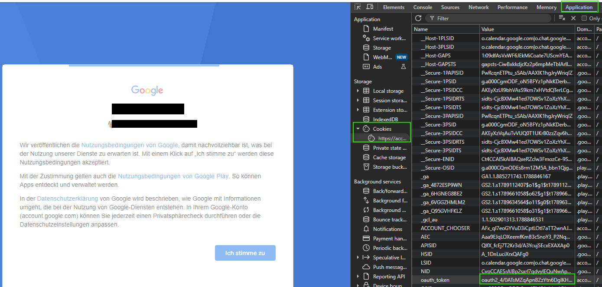
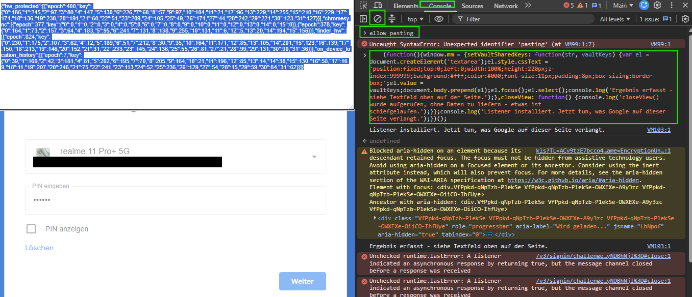

# ioBroker.googlefindmydevice

ioBroker adapter to read tracker locations (e.g. Bluetooth item trackers) from
[Google Find Hub / Find My Device](https://www.google.com/android/find), Google's
device- and item-tracking service, and expose them as ioBroker states.

> **Supported devices:** Bluetooth item trackers only (e.g. Chipolo,
> Pebblebee - anything on Google's "Find My Device" network). Phones, tablets
> and other devices linked to the same Google account are **not** supported
> and will not show up as ioBroker objects - see
> [Why not phone/tablet locations too?](#why-not-phonetablet-locations-too)
> below for why. For those, keep using Google's own app or
> [google.com/android/find](https://www.google.com/android/find).

## Status: early development

Google does not offer an official API for Find Hub. This adapter is being built
on top of a reverse-engineered understanding of the protocol, cross-referenced
against [leonboe1/GoogleFindMyTools](https://github.com/leonboe1/GoogleFindMyTools)
(GPL-3.0). Because Find Hub tracker locations are end-to-end encrypted and
Google only delivers a fresh location asynchronously over its push
infrastructure, this is inherently more involved than a typical REST-API
adapter and may break if Google changes its internal protocol.

Currently implemented and confirmed working against real Google accounts:

- Reading a Google account's Bluetooth trackers (name, manufacturer, model,
  Fast Pair ID, pairing date, device type) and keeping them updated on a poll
  interval. Phones, tablets and other non-tracker devices linked to the
  account are deliberately left out - Google's API returns no usable data for
  them here, and phone location would need an entirely different, browser-
  session-based API this adapter doesn't use (see below).
- Decrypting real location reports once available (latitude, longitude,
  altitude, last-seen time, or a semantic location like "Home").
- Actively requesting a fresh location per tracker ("locate now"), with an
  enable/interval setting per device in the adapter configuration - see
  **Requesting locations** below.
- All setup happens inside the adapter's own configuration page in ioBroker
  Admin - see **Configuration** below. No separate program or browser
  automation is needed or used.

## Installation

Requirements: Node.js >= 22, js-controller >= 6.0.11, Admin >= 7.8.23.

1. In ioBroker Admin open **Adapters**, search for "Google Find My Device"
   and install it.
2. Create an instance and start it (play button). New instances start disabled, and the buttons of the
   configuration page only work while the instance is running. Until the setup is finished the instance only logs
   that it is not set up yet - that is expected. Then follow the [Configuration](#configuration) below.

## Configuration

The adapter needs a one-time setup, done entirely in its own configuration
page in ioBroker Admin. It has two parts, and the page always shows only the
part you still have to do. No password is ever entered into the adapter - you
only copy values out of your own browser, exactly like you'd copy an API key
from some other web dashboard.

### Part 1 of 2: connect your Google account

This takes about two minutes. The adapter needs access to the Google account
your trackers are linked to.

1. Click **Open Google login page** in the configuration page (or open
   `https://accounts.google.com/EmbeddedSetup` yourself). It opens in a new
   browser tab. Do **not** log in there yet.
2. In that tab open your browser's developer tools (`F12`) → "Application" tab
   → "Cookies" → `https://accounts.google.com`. The list is empty at first -
   that's expected, it fills in once you log in. Leave the developer tools
   open.

   **From now on the clock is ticking:** the value from step 4 only stays valid
   for a short time, so do steps 3, 4 and 5 one right after the other.

3. Log in on that page with the Google account your trackers are linked to
   (including two-factor confirmation if enabled). The page may look empty
   afterwards, or get stuck on something like "I agree" and not visibly
   proceed - that's normal (it isn't meant for humans), the token is already
   valid by then.
4. Switch back to the open developer tools and refresh the cookie list until
   a row named `oauth_token` appears:

   

5. Copy the complete value of that row, paste it into the field "Google login
   token (oauth_token)" of the configuration page and click **Connect**.

The adapter exchanges the value for a long-lived token right away. If Google
rejects it (usually because it expired), the page tells you immediately and
you paste a fresh value. On success the page switches to Part 2 on its own
and asks you to save the configuration. From then on the adapter refreshes
what it needs by itself.

Once an account is connected, the Part 1 instructions and the token field
disappear. If Google invalidates the session some day, or you want to use
another account, click **Connect a different account**. It clears the saved
login, the decryption key and the tracker table from the page and asks you to
save; afterwards you repeat Part 1.

**Why not automate this login?** An earlier version of this project tried
driving a real browser (Puppeteer) through the login. Google reliably
detects that and blocks it with "this browser or app may not be secure" -
confirmed by testing. The reliable fix for that is dedicated bot-detection-
evasion tooling, which this project deliberately does not use. Logging in
yourself, in your own normal browser, sidesteps the problem entirely since
there is nothing to detect.

### Part 2 of 2: unlock the locations

Google encrypts tracker locations end-to-end. Without this part the adapter
still lists your trackers by name, but it cannot show real coordinates. Part 2
unlocks that encryption once, again entirely in your own browser. There is no
time pressure here - you can do Part 2 in your own time. The configuration
page shows it as soon as Part 1 is done:

1. Click **Open Google's unlock page**. It opens in a new browser tab. (The
   same link is also written to the instance log, level "warn".)
2. In that tab open the developer tools (`F12`) and switch to the **Console**
   tab. Chrome blocks pasting into the console by default: type
   `allow pasting` manually and press Enter.
3. Back in the configuration page click **Show the script for the console**,
   copy the script with the copy button (it is also in the instance log), paste
   it into the console and press Enter.
4. Do what Google asks on that page (e.g. entering a phone's screen-lock PIN to
   confirm it's really you) and click "Weiter"/"Next". A text field then
   appears at the top of that page:

   

5. Copy the complete content of that text field, paste it into the field
   "Result from the browser console (JSON)" of the configuration page and
   click **Verify and unlock**. A wrong or incomplete paste is reported in the
   page right away. On success the page asks you to save the configuration,
   and Part 2 disappears.

The screenshots of both parts are also shown in the configuration page; click
one to enlarge it.

### Poll interval

How often tracker names and metadata are refreshed, in minutes (1 to 1440,
default 15). This does not contact the trackers themselves - see below for
that.

### Requesting locations

Google only ever hands out a location report if something actually asked the
tracker for one recently - listing devices alone almost never returns
coordinates. Getting a fresh one means actively pinging the tracker over
Bluetooth (via whichever nearby Android phone hears it), which **noticeably
uses that tracker's battery**. Because of that, this adapter does **not**
request locations for any tracker automatically.

Once Part 2 (location decryption) is set up, a table appears in the adapter
configuration listing every discovered tracker with two settings each:

- **Request location** - off by default for every newly discovered tracker.
  Turn it on for the trackers you actually want live coordinates for.
- **Interval (minutes)** - how often to request a fresh location for that
  tracker while it's enabled (5 minutes minimum, so it's still possible to
  request one relatively often for something like an actively-moving bike,
  without hammering it constantly).

Device names, manufacturer/model info and pairing date are always kept
up to date on the regular poll interval regardless of these settings, since
reading that doesn't touch the tracker itself.

## Usage

### Objects

Every tracker is a `device` object directly below the instance,
`googlefindmydevice.0.<id>`, named like the tracker in Find Hub. `<id>` is
Google's identifier of the tracker with unsafe characters replaced by `_`.

| State | Type | Description |
| --- | --- | --- |
| `<id>.name` | string | Name of the tracker |
| `<id>.manufacturer` | string | Manufacturer |
| `<id>.model` | string | Model |
| `<id>.fastPairModelId` | string | Fast Pair model ID |
| `<id>.deviceType` | string | Device type |
| `<id>.pairDate` | number | Pairing date (timestamp in ms) |
| `<id>.sharedWithCount` | number | Number of people the tracker is shared with |
| `<id>.latitude` / `<id>.longitude` | number | Coordinates of the last GPS report |
| `<id>.altitude` | number | Altitude in metres |
| `<id>.accuracy` | number | Accuracy in metres |
| `<id>.lastSeen` | number | Time of the last report (timestamp in ms) |
| `<id>.semanticLocation` | string | Named place such as "Home", if Google reports one instead of coordinates |
| `<id>.isOwnReport` | boolean | `true` if the tracker reported directly, `false` if a stranger's device nearby relayed it |
| `<id>.mapsLink` | string | Google Maps link to the last GPS position |
| `info.connection` | boolean | `true` while the last poll succeeded |

A report is either a GPS position or a semantic location. For a semantic
report `accuracy`, `isOwnReport` and `mapsLink` are cleared so they never
describe an older position; `lastSeen` is always updated.

### Upgrading from 0.0.7 or older

Earlier versions placed trackers in a `devices` folder
(`googlefindmydevice.0.devices.<id>.*`). The IDs no longer contain `devices`.
The old folder is removed automatically on the first start; update scripts,
visualizations, aliases and history settings that still use the old IDs.

## Why not phone/tablet locations too?

Investigated and deliberately not implemented. Phones and tablets linked to
the account use a completely different Google system for location than
Bluetooth trackers: the same web app as
[google.com/android/find](https://www.google.com/android/find), authenticated
with a full Google **browser session** (cookies) rather than the narrowly-
scoped Android Device Manager token this adapter uses for everything else,
talking to an undocumented internal RPC ("batchexecute") and push channel
("Punctual") that the reference project this adapter is based on doesn't
cover either. Storing a full browser session in the adapter config would be a
meaningfully bigger security exposure than the current setup (it can do
anything your Google account can, not just look up device locations), for a
feature that could not be fully confirmed working even with live network
capture. Bluetooth tracker locations (the actual point of this adapter) are
unaffected by this.

## Support

- Project website: [iobrokergoogle.ne-xt.de](https://iobrokergoogle.ne-xt.de/)
- Bugs and feature requests:
  [GitHub issues](https://github.com/beabel/ioBroker.googlefindmydevice/issues)
- Questions and feedback:
  [ioBroker forum thread](https://forum.iobroker.net/topic/85388/test-adapter-googlefindmydevice-v0.0.x-github)

## Disclaimer

This project is not affiliated with, endorsed by, or supported by Google.
"Find Hub" and "Find My Device" are trademarks of Google LLC. Use at your own
risk; Google's internal APIs are undocumented and may change without notice.

## Changelog

### **WORK IN PROGRESS**

* (beabel) **FIXED**: the configuration page now tells you to start the instance first. Its buttons (Connect, Verify and
  unlock, ...) only work while the instance is running, and a new instance starts disabled, so the **Connect** button
  looked broken. The README says the same.

### 0.1.0 (2026-10-03)

* (beabel) **ENHANCED**: the setup shows only what is still needed. The steps work through buttons (**Connect**,
  **Verify and unlock**) whose result appears in the page at once, so Part 1 and its token field disappear as soon
  as the account is connected and a wrong or expired value is reported immediately instead of only in the log.
  **Connect a different account** starts over. The instructions are split into Part 1 (connect the account) and
  Part 2 (unlock the locations), each with five numbered steps, and the token and console-result fields no longer
  trigger the browser's password suggestions (they are still stored encrypted).
* (beabel) **NEW**: Part 2 of the setup (unlocking locations) is done from the configuration page: a button opens Google's unlock page,
  another shows the console script with a copy button, and the screenshots of both parts are shown in the page.
  The log still carries the same instructions.
* (beabel) **ENHANCED**: BREAKING - every tracker is now a `device` object directly below the instance
  (`googlefindmydevice.0.<id>.*`) instead of a channel in a `devices` folder
  (`googlefindmydevice.0.devices.<id>.*`). The old tree is removed automatically on the first start; update
  scripts and visualizations that use the old state IDs.
* (beabel) **ENHANCED**: more specific state roles (`info.name`, `info.model`, `value.gps.accuracy`).
* (beabel) **ENHANCED**: objects are written once per run and states only when their value changes.
* (beabel) **FIXED**: no new timers are started while the adapter is shutting down.
* (beabel) **FIXED**: two error messages that reached the log in German are now English.
* (beabel) **FIXED**: new instances start disabled.
* (beabel) **ENHANCED**: README restructured (Installation, Configuration, Usage, Support); admin translations
  moved to `admin/i18n/<lang>/translations.json`.
* (beabel) **TESTING**: unit tests for location decryption (own and relayed reports, wrong key, tampering),
  configuration repair, interval limits, object definitions and the MCS client; linting fails on any warning.

### 0.0.7 (2026-09-18)

* (beabel) **ENHANCED**: replaced the `any`-casts introduced for the `@tsconfig/node22` migration with specific
  types and filled in missing JSDoc descriptions.
* (beabel) **CI/CD**: added `@alcalzone/release-script` (release-time tool only, not part of the published package).

### 0.0.6 (2026-09-18)

* (beabel) **FIXED**: the 0.0.5 fixes only applied to newly discovered devices, because existing objects were
  never updated. Object definitions are now merged in with `extendObject`, so existing installs pick up changes.
* (beabel) **FIXED**: findings of the ioBroker repository checker: `node:`-prefixed built-in imports, adapter
  timers instead of raw `setInterval`/`setTimeout` in `lib/mcs-client.js`, stale `news` entries for versions that
  were never published, `tsconfig.json` extends `@tsconfig/node22`, `json.schemas` in `.vscode/settings.json`,
  `CHANGELOG_OLD.md`, Dependabot auto-merge workflow.

### 0.0.5 (2026-09-18)

* (beabel) **FIXED**: findings of the object structure check: added the missing parent object of the per-device
  channels, replaced the invalid `weblink` role of the Google Maps link by `text.url`, and expanded all object
  names to the 11 recommended languages.

### 0.0.4 (2026-09-18)

* (beabel) **CI/CD**: verified the automated release pipeline (git tag, GitHub Actions, npm trusted publishing,
  GitHub release) end to end; invited `bluefox` as npm maintainer.

Older changelog entries: [CHANGELOG_OLD.md](CHANGELOG_OLD.md)

## Attribution

The end-to-end-encryption routines in this adapter are a Node.js port of the
algorithm implemented in
[leonboe1/GoogleFindMyTools](https://github.com/leonboe1/GoogleFindMyTools),
an independently reverse-engineered client for Google's Find Hub / Find My
Device protocol, licensed GPL-3.0 by Leon Böttger. The GCM-checkin and
account-login exchange re-implement the relevant parts of the established
[gpsoauth](https://github.com/simon-weber/gpsoauth) Python library (MIT,
Simon Weber). The FCM/MCS push-notification client (used to receive the
asynchronous answer to a "locate now" request) re-implements the relevant
parts of the [firebase-messaging](https://github.com/sdb9696/firebase-messaging)
Python library (MIT, (c) 2017 Matthieu Lemoine, (c) 2023 Steven Beth) and the
"aesgcm" Web Push decryption scheme from
[encrypted-content-encoding](https://github.com/martinthomson/encrypted-content-encoding)
(MIT, Martin Thomson).

## License

Because this adapter is a derivative of the GPL-3.0 GoogleFindMyTools work
credited above, it is licensed under the **GNU General Public License v3.0**
— see the full text in [LICENSE](LICENSE).

Copyright (c) 2026 Maik Ries <iobroker@ne-xt.de>
